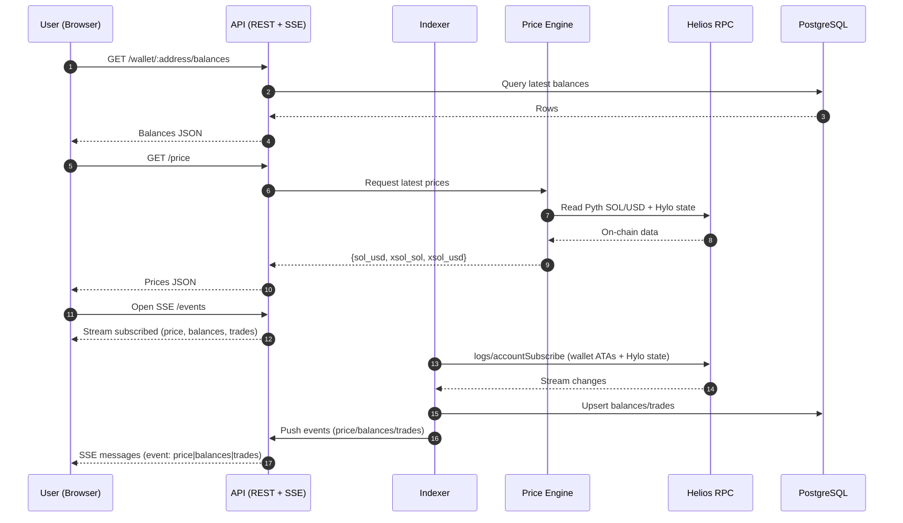
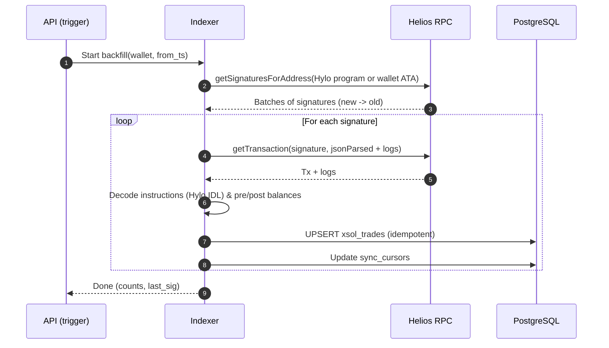

# Hylo Wallet Tracker — High-Level Architecture (Solana mainnet)

**Scope:** Read-only analytics app tracking a single wallet’s Hylo activity on **Solana mainnet-beta**. Near real-time prices (SOL, xSOL), holdings (hyUSD, sHYUSD, xSOL), and xSOL trade history.

**Decisions (locked):**

- **Explorer:** Solscan
- **Realtime transport:** **SSE** (Server-Sent Events)
- **Deployment target:** **Docker Compose** (local & server)

---

## Assumptions (from PRD)

- Track **hyUSD, sHYUSD, xSOL** balances and **xSOL buys/sells** only.
- Prices via **Pyth SOL/USD**; **xSOL** price computed from Hylo state + formulas (from Hylo docs/SDK).
- **Helios** RPC for HTTP and WebSocket subscriptions (backend-only).
- Backend: **Golang**, Frontend: **React (Vite, PNPM)**
- Near real-time targets: **P95 < 2s** for price/balances, **< 5s** for new trades.

---

## Logical Architecture

```mermaid
graph TB
  subgraph Client["Browser (React, PNPM)"]
    UI[UI: Price Header, Holdings Card, Trades Table]
    SSE[SSE Client (/events)]
  end

  subgraph Backend["Golang Services"]
    API[API Gateway (REST + SSE)]
    IDX[Indexer / Ingestor]
    PRC[Price Engine (Pyth + Hylo formulas)]
    PARSER[Tx/Log Parser (Hylo IDL)]
    CACHE[(In-memory Cache)]
  end

  subgraph Data["Storage & Observability"]
    PG[(PostgreSQL)]
    MET[Metrics (Prometheus)]
    LOGS[Structured Logs]
  end

  subgraph Chain["Solana mainnet-beta"]
    HELIOS[[Helios RPC (HTTP + WS)]]
    PYTH[(Pyth SOL/USD Price Account)]
    HYLO[(Hylo Programs + Token Accounts)]
  end

  UI <--> SSE
  SSE --> API
  API --> CACHE
  API --> PG
  API --> PRC
  PRC --> CACHE
  IDX --> PARSER
  PARSER --> PG
  IDX --> PG
  IDX --> CACHE
  IDX -->|WS: account/logs| HELIOS
  PRC -->|read| HELIOS
  PRC -->|read| PYTH
  IDX -->|historical RPC| HELIOS
  API --> MET
  IDX --> MET
  API --> LOGS
  IDX --> LOGS
```

**Responsibilities**

- **API Gateway**: REST endpoints (`/price`, `/wallet/:addr/balances`, `/wallet/:addr/trades`), **SSE** stream (`/events`), rate-limited, response shaping (adds **Solscan** links).
- **Indexer**:
  - Subscribes (WS) to Hylo program logs / accounts; watches wallet ATAs for hyUSD/sHYUSD/xSOL.
  - Backfills historical xSOL **mint/redeem** via `getSignaturesForAddress` + decoding.
  - Emits normalized events → DB + cache.
- **Price Engine**: Reads Pyth SOL/USD, fetches Hylo state, computes **xSOL price (SOL)** → **xSOL price (USD)**; staleness/confidence checks; writes to cache & snapshots to DB.
- **Parser**: Instruction & log decoding using SDK/IDL; derives side (BUY/SELL) and amounts (pre/post balances + args).
- **PostgreSQL**: Durable store for `price_snapshots`, `wallet_balances`, `xsol_trades`, `sync_cursors`, `ingest_failures`.
- **Cache**: Low-latency hot path for price/holdings; TTL-based invalidation on chain events.
- **Observability**: Prometheus metrics (ingest lag, freshness, RPC errors), structured logs.

---

## Sequence: Wallet Load & Live Subscribe (SSE)



---

## Sequence: Historical Backfill (xSOL Trades)



---

## Flowchart: Realtime Price & Balance Update

```mermaid
flowchart TD
  A[Chain Event: Account/Logs] --> B{Is Hylo state or wallet ATA?}
  B -- No --> Z[Ignore]
  B -- Yes --> C[Parse change (IDL/decoders)]
  C --> D{Affects price?}
  D -- Yes --> E[Price Engine recompute xSOL price]
  E --> F[Cache set + snapshot to DB]
  D -- No --> G[Update balances/trades in DB]
  F --> H[Notify API]
  G --> H[Notify API]
  H --> I[SSE push to clients]
```

---

## Minimal Data Model (MVP)

```mermaid
erDiagram
  price_snapshots {
    timestamptz ts
    bigint slot
    numeric sol_usd
    numeric xsol_sol
    numeric xsol_usd
  }
  wallet_balances {
    text wallet
    timestamptz ts
    bigint slot
    numeric hyusd
    numeric shyusd
    numeric xsol
  }
  xsol_trades {
    text sig PK
    bigint slot
    timestamptz ts
    text wallet
    text side  // BUY|SELL
    numeric amount_xsol
    text counter_symbol // hyUSD or SOL (if applicable)
    numeric amount_counter
    text explorer_url // prebuilt Solscan link
  }
  sync_cursors {
    text name PK
    text last_sig
    bigint last_slot
  }
  ingest_failures {
    bigserial id PK
    timestamptz ts
    text context
    text error
  }
```

**Solscan link format:** `https://solscan.io/tx/<signature>` (mainnet). The **API** may precompute and store `explorer_url` alongside each trade for convenience.

---

## Public API (MVP)

- `GET /price` → `{ sol_usd, xsol_sol, xsol_usd, updated_at }`
- `GET /wallet/:address/balances` → `{ hyusd, shyusd, xsol, values_usd, slot, updated_at }`
- `GET /wallet/:address/trades?cursor=<sig>&limit=25` → `[{ ts, slot, sig, side, amount_xsol, amount_counter, counter_symbol, explorer_url }]`
- `GET /health` → readiness/liveness
- **Realtime:** **`/events` (SSE)** — named events: `price`, `balances`, `trades`; include heartbeat (`event: ping`).

---

## Deployment — Docker Compose (Target)

```mermaid
graph LR
  subgraph Docker Compose
    API[api: Go (REST+SSE)] --- DB[(postgres:15)]
    IDX[indexer: Go] --- DB
    API --- MET[Prometheus (optional)]
    IDX --- MET
  end
```

**Compose services (conceptual):**

- **api** (port 8080): env `RPC_HTTP_URL`, `RPC_WS_URL`, `PYTH_SOL_USD_ADDR`, `DB_URL`, `SSE_HEARTBEAT_MS`, `RATE_LIMIT_RPS`.
- **indexer** (no public port): env `RPC_HTTP_URL`, `RPC_WS_URL`, `PYTH_SOL_USD_ADDR`, `LOOKBACK_DAYS`, `COMMITMENT_LIVE=confirmed`, `COMMITMENT_BACKFILL=finalized`, `DB_URL`.
- **postgres**: mounted volume; init schema migrations at container start (Go `migrate`).
- **prometheus** (optional): scrape API/Indexer metrics endpoints.

---

## SSE Message Formats

- **price (event):**
  ```json
  {
    "sol_usd": 182.35,
    "xsol_sol": 2.7149,
    "xsol_usd": 494.04,
    "updated_at": "2025-09-02T12:01:22Z"
  }
  ```
- **balances (event):**
  ```json
  {
    "wallet": "<addr>",
    "slot": 294112233,
    "hyusd": "1000.0",
    "shyusd": "250.0",
    "xsol": "4.123456",
    "values_usd": { "hyusd": 1000.0, "shyusd": 250.0, "xsol": 2037.02 },
    "updated_at": "2025-09-02T12:01:22Z"
  }
  ```
- **trades (event):**
  ```json
  {
    "ts": "2025-08-31T20:10:05Z",
    "slot": 293998877,
    "sig": "<signature>",
    "side": "BUY",
    "amount_xsol": "1.25",
    "counter_symbol": "hyUSD",
    "amount_counter": "600.00",
    "explorer_url": "https://solscan.io/tx/<signature>"
  }
  ```

---

## Config & Env

- `RPC_WS_URL` / `RPC_HTTP_URL` (Helios), `PYTH_SOL_USD_ADDR`
- Hylo program IDs, mints, PDA seeds (from docs/SDK)
- `LOOKBACK_DAYS` (default 365), `COMMITMENT_LIVE=confirmed`, `COMMITMENT_BACKFILL=finalized`
- `DB_URL`, `CACHE_TTL_SEC`, `SSE_HEARTBEAT_MS`, `RATE_LIMIT_RPS`

---

## Observability & SLIs

- **Freshness (frontend):** UI shows `updated_at`; stale badge if > N sec.
- **SLIs:** Ingest lag (slot delta), trade parse error rate, RPC error rate, P95 publish latency (event→client).
- **Alerts:** Pyth staleness > N sec; Helios WS disconnect loops; DB write failures.

---

## Security & Privacy

- Read-only; no private keys.
- Validate wallet (Base58), bound queries (limit/offset), sanitize links.
- TLS on ingress; CORS allowlist.

---

## Open Items

1. Confirm Hylo instruction discriminators used to tag **BUY/SELL** precisely.
2. Confirm token **decimals** for hyUSD, sHYUSD, xSOL for rounding/formatting consistency.
